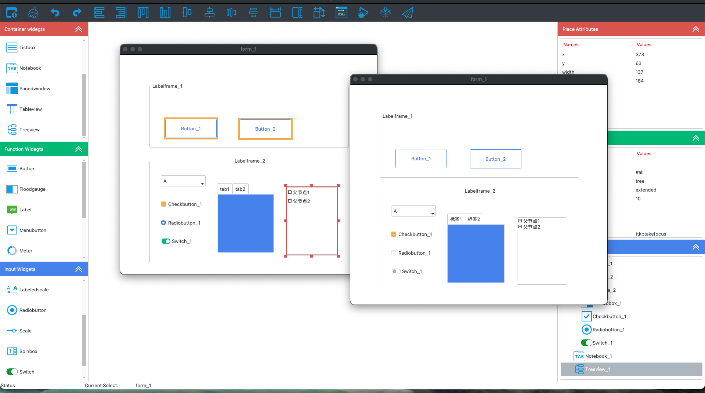
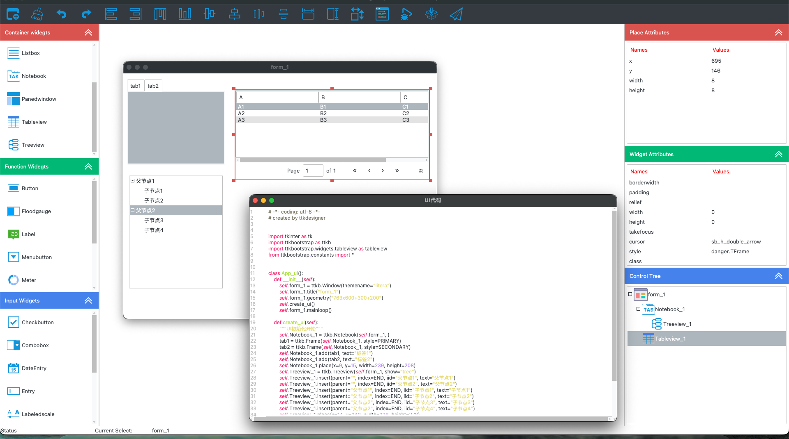

# Ttkdesigner

**A visual GUI designer for Tkinter and ttkbootstrap.** Drag widgets onto a canvas, watch the interface update live, and export clean, runnable Python code. Or describe a screen in one sentence and let the built-in AI design assistant build it.

[](https://github.com/mkoijnn2/ttkdesigner/releases)
[](https://www.python.org/)
[](https://github.com/israel-dryer/ttkbootstrap)
[](https://github.com/mkoijnn2/ttkdesigner/releases)
[](LICENSE)

**[⬇️ Download the free trial](https://github.com/mkoijnn2/ttkdesigner/releases/latest)** · **[🛒 Full version](http://122.152.227.49/ttkping/)**

---

## The problem

Tkinter layout code is fiddly to write and slow to iterate on. Positioning, nesting, padding, fonts, and theme settings all live in code you have to run before you can see them. Sketching a screen often takes longer than the logic behind it.

Ttkdesigner moves that loop onto a canvas. Place widgets, adjust properties in a panel, watch the interface update as you go. When it looks right, export Python.

It is built for the [ttkbootstrap](https://github.com/israel-dryer/ttkbootstrap) ecosystem specifically (2,648 stars, roughly 117,000 downloads a month on PyPI), rather than for classic unstyled ttk.



*Widget palette on the left, live canvas in the center, property and hierarchy panels on the right.*

## Highlights

- **Live WYSIWYG canvas** — the preview runs actual ttkbootstrap widgets, not a static mockup
- **30+ widgets** — Button, Label, Entry, Text, Combobox, Listbox, Treeview, Tableview, Notebook, Progressbar, Scale, Spinbox, DateEntry, Meter, Floodgauge, PanedWindow, ScrolledFrame, Separator, and more
- **Widget nesting with a hierarchy tree** — restructure layouts without rewriting code
- **Multi-select, batch property edits** — change a shared attribute across many widgets at once
- **One-click code generation** — readable, commented, runnable Python, and you can run it from inside the app
- **Place and grid layouts**, event binding, theming, and project files saved as JSON
- **AI design assistant** — a sentence in, a loadable screen out



*Design on the canvas, get the code next to it.*

## How it compares

- **PAGE** — the long-standing Tkinter GUI builder. Generates Tkinter source, but its editor is dated and it has no ttkbootstrap theme support.
- **pygubu** — defines interfaces in a `.ui` XML file that your app loads at runtime. Ttkdesigner exports standalone Python source that you own outright.
- **Qt Designer, wxFormBuilder** — target Qt and wxWidgets, not Tkinter.

What Ttkdesigner adds is ttkbootstrap-native widgets and theming, and an AI path from a description to a working screen.

## AI design assistant

Added in v1.1.17. Describe what you want in one sentence and it produces a working screen, not a picture of one.

- **Streaming responses** — output appears token by token, with stop and retry
- **Inline preview card** — the generated design appears in the conversation, and one click loads every widget onto the canvas
- **Canvas-aware** — the current canvas is sent as context, so follow-up messages work as edits ("make the title red", "move the table up")
- **Quick prompts** — login form, data entry, settings page, file manager
- **Multi-model configuration** — switch between saved API profiles. Presets are included for DeepSeek, Qwen, Doubao, and Agnes (Agnes is a newer provider offering a free OpenAI-compatible endpoint). Any OpenAI-compatible endpoint can be added.
- **Bring your own key** — you supply the API credentials, so conversations are not metered by this app

## Quick start

1. Download the trial zip from [Releases](https://github.com/mkoijnn2/ttkdesigner/releases/latest)
2. Unzip it anywhere and run `Ttkdesigner.exe` — no installer, no login, no license key
3. Design your interface and export the Python code

To run the code it generates:

```bash
pip install ttkbootstrap==1.20.3
python design.py
```

`requirements.txt` is included in the download. If your AI-generated designs use extra image formats, `pip install Pillow` as well.

## Trial vs. full version

The trial is a feature-limited build, not a countdown. No time limit, no login screen, no license key, no activation server.

| | Trial | Full |
|---|:---:|:---:|
| Visual designer, canvas, live preview | ✅ | ✅ |
| Code generation, running generated code | ✅ | ✅ |
| All 30+ widgets, layouts, theming | ✅ | ✅ |
| AI design assistant | ✅ (max 12 widgets per load) | ✅ (no limit) |
| Project save and load | ✅ | ✅ |
| Export to a standalone `.exe` | — | ✅ |
| Import an existing Python file into the canvas | — | ✅ |
| Virtual environment creation / rebuild | — | ✅ |
| Save or copy AI designs as files / JSON | — | ✅ |
| All four quick prompts | 2 of 4 | ✅ |
| Launch watermark | 3-second countdown | — |

Locked features explain what they do when you click them, rather than failing silently.

## Pricing

The trial is free. Full-version activation is sold as time-limited cards, in CNY, through the vendor page (WeChat Pay):

| Card | Price |
|---|---|
| Day | ¥1 |
| Month | ¥10 |
| Quarter | ¥28 |
| Year | ¥100 |
| Perpetual | ¥299 |

## Requirements

- **Windows 10 / 11 (64-bit)**
- **Python 3.7+** — only needed to run the code you export, not the designer itself
- **ttkbootstrap 1.20.3** for generated programs; other versions may differ in API

### Known limitations

- **The application UI is in Simplified Chinese.** Exported Python code is standard English-language Python.
- **The binary is not code-signed.** Windows SmartScreen may warn on first launch; choose *More info* then *Run anyway*.
- **AI features need your own API key.** Canvas content is sent to the provider you configure. See [LICENSE](LICENSE) section 6.

## Community and support

- **Bug reports and feature requests:** [open an issue](https://github.com/mkoijnn2/ttkdesigner/issues)
- **QQ group (free, Chinese):** 951416878
- **Video tutorials (Chinese):** [Bilibili collection](https://space.bilibili.com/1434239889/lists/6417170?type=season)
- **Gitee mirror:** https://gitee.com/wengjianhua/ttkboot---design-master
- **Purchase page:** http://122.152.227.49/ttkping/

## License

Commercial software. The trial build is free to download and evaluate. See [LICENSE](LICENSE) for terms. This repository hosts documentation, screenshots, and release binaries; the application source code is not published here.

Generated code is yours: the license claims no rights over the Python you produce with the app.

---

## 中文说明

**TTKBootstrap设计大师**是一款面向 Python 开发者的可视化 GUI 设计工具。拖拽组件搭建界面，实时看到最终效果，一键导出可运行的 ttkbootstrap 代码；也可以用一句话让内置的 AI 设计助手直接生成界面。

它是**专门为 ttkbootstrap 生态做的**（该库 2,648 star，PyPI 月下载约 11.7 万次），而不是针对不带主题的经典 ttk。


*左侧组件库，中间画布，右侧属性与层级面板。*

### 核心特性

- **所见即所得画布** —— 预览运行的是真实的 ttkbootstrap 控件，不是效果图
- **30+ 种组件** —— Button、Label、Entry、Text、Combobox、Listbox、Treeview、Tableview、Notebook、Progressbar、Scale、Spinbox、DateEntry、Meter、Floodgauge、PanedWindow、ScrolledFrame、Separator 等
- **控件嵌套 + 层级树** —— 结构调整不必回头改代码
- **多选批量改属性** —— 一次调整多个控件的同一属性
- **一键生成代码** —— 结构清晰、带注释、可直接运行，也能在软件内直接跑起来看效果
- **Place / Grid 布局**、事件绑定、主题切换、项目保存为 JSON
- **AI 设计助手** —— 一句话进去，一个可加载的界面出来


*画布上设计，旁边就是代码。*

### 与同类工具的区别

- **PAGE** —— 老牌 Tkinter 界面生成器，但编辑器陈旧，不支持 ttkbootstrap 主题
- **pygubu** —— 用 `.ui` XML 描述界面、运行时加载；本工具直接导出你可以完全拥有的独立 Python 源码
- **Qt Designer / wxFormBuilder** —— 面向 Qt 与 wxWidgets，不是 Tkinter

本工具补上的，是 ttkbootstrap 原生组件与主题，以及从一句话到可用界面的 AI 通路。

### AI 设计助手（v1.1.17 新增）

一句话描述你要的界面，直接生成可运行的 ttkbootstrap 程序。

- **流式对话**：逐字实时输出，可随时停止、一键重试
- **内联预览卡片**：设计以卡片形式出现在对话中，点一下即把所有控件落位到画布
- **画布上下文感知**：自动携带当前画布，支持增量修改，比如“把标题改成红色”“表格往上挪”
- **快捷指令**：内置登录界面、数据录入、设置页面、文件管理四类模板
- **多模型管理**：多套 API 配置自由切换。预置 DeepSeek、通义千问、豆包、Agnes（Agnes 是较新的服务商，提供免费的 OpenAI 兼容接口）。任何 OpenAI 兼容接口都可以添加。
- **自带 API Key**：用你自己的凭据，对话次数不受本软件限制

### 快速开始

1. 到 [Releases](https://github.com/mkoijnn2/ttkdesigner/releases/latest) 下载体验版压缩包
2. 解压到任意目录，双击 `Ttkdesigner.exe` 启动。无需安装、无需登录、无需卡密
3. 设计界面，导出代码

运行生成的代码前：

```bash
pip install ttkbootstrap==1.20.3
python design.py
```

压缩包内已附 `requirements.txt`。

### 体验版 vs 完整版

体验版是**功能受限版，不是倒计时版**：没有时间限制、没有登录页、没有卡密校验，也不连接任何授权服务器。

| 功能 | 体验版 | 完整版 |
|---|:---:|:---:|
| 可视化设计、画布、实时预览 | ✅ | ✅ |
| 代码生成、运行生成的代码 | ✅ | ✅ |
| 全部 30+ 组件、布局、主题 | ✅ | ✅ |
| AI 设计助手 | ✅（单次加载上限 12 个控件） | ✅（不限） |
| 项目保存与加载 | ✅ | ✅ |
| 打包为独立 exe | — | ✅ |
| 导入 Python 源码到画布 | — | ✅ |
| 虚拟环境创建 / 重建 | — | ✅ |
| AI 设计保存 / 复制为 JSON | — | ✅ |
| 四类快捷指令 | 2 / 4 | ✅ |
| 运行前水印 | 3 秒倒计时 | 无 |

被限制的功能点击后会明确说明它能帮你做什么，不会静默失败。

### 价格

体验版免费。完整版以时长卡形式激活，人民币计价，通过购买页用微信支付：

| 卡种 | 价格 |
|---|---|
| 天卡 | ¥1 |
| 月卡 | ¥10 |
| 季卡 | ¥28 |
| 年卡 | ¥100 |
| 永久卡 | ¥299 |

### 系统要求

- Windows 10 / 11（64 位）
- Python 3.7+（仅运行导出的代码时需要，设计器本身不需要）
- ttkbootstrap 1.20.3

### 已知限制

- **软件界面为简体中文**，导出的 Python 代码为通用英文 Python
- **未做代码签名**，首次运行可能遇到 Windows SmartScreen 提示，选择“更多信息”→“仍要运行”
- **AI 功能需要你自己的 API Key**，画布内容会发送给你配置的服务商，详见 [LICENSE](LICENSE) 第六条

### 联系与支持

- **问题反馈**：[提交 issue](https://github.com/mkoijnn2/ttkdesigner/issues)
- **免费 QQ 群**：951416878
- **视频教程**：[B站合集](https://space.bilibili.com/1434239889/lists/6417170?type=season)
- **Gitee 镜像**：https://gitee.com/wengjianhua/ttkboot---design-master
- **购买完整版**：http://122.152.227.49/ttkping/

### 授权

商业软件。体验版可免费下载评估，条款见 [LICENSE](LICENSE)。本仓库用于托管文档、截图与发行版二进制，应用源代码不在此公开。

**生成的代码归你所有**：协议不对你用它产出的 Python 代码主张任何权利。
